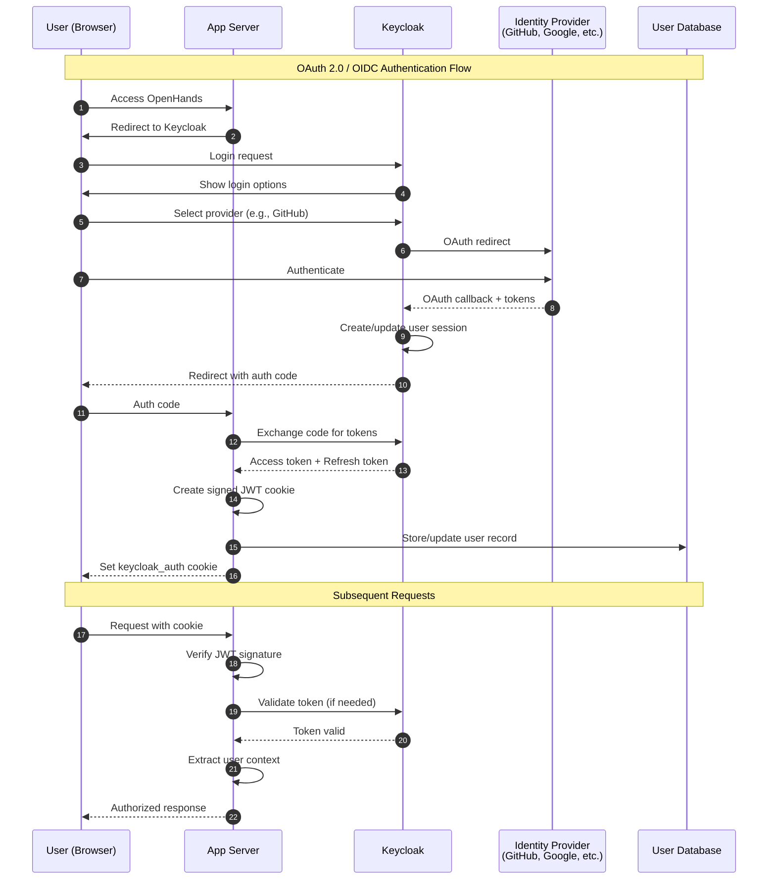

# Authentication Flow (SaaS Deployment)

OpenHands uses Keycloak for identity management in the SaaS deployment. The authentication flow involves multiple services:

### Authentication Components

| Component | Purpose | Location |
|-----------|---------|----------|
| **Keycloak** | Identity provider, SSO, token management | External service |
| **UserAuth** | Abstract auth interface | `openhands/server/user_auth/user_auth.py` |
| **SaasUserAuth** | Keycloak implementation | `enterprise/server/auth/saas_user_auth.py` |
| **JWT Service** | Token signing/verification | `openhands/app_server/services/jwt_service.py` |
| **Auth Routes** | Login/logout endpoints | `enterprise/server/routes/auth.py` |

### Token Flow

1. **Keycloak Access Token**: Short-lived token for API access
2. **Keycloak Refresh Token**: Long-lived token to obtain new access tokens
3. **Signed JWT Cookie**: App Server's session cookie containing encrypted Keycloak tokens
4. **Provider Tokens**: OAuth tokens for GitHub, GitLab, etc. (stored separately for git operations)
