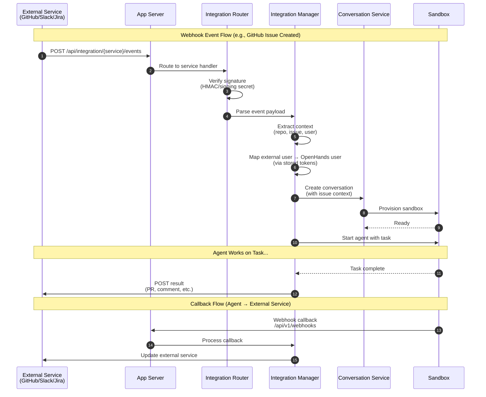

# External Integrations

OpenHands integrates with external services (GitHub, Slack, Jira, etc.) through webhook-based event handling:



### Supported Integrations

| Integration | Trigger Events | Agent Actions |
|-------------|----------------|---------------|
| **GitHub** | Issue created, PR opened, @mention | Create PR, comment, push commits |
| **GitLab** | Issue created, MR opened | Create MR, comment, push commits |
| **Slack** | @mention in channel | Reply in thread, create tasks |
| **Jira** | Issue created/updated | Update ticket, add comments |
| **Linear** | Issue created | Update status, add comments |

### Integration Components

| Component | Purpose | Location |
|-----------|---------|----------|
| **Integration Routes** | Webhook endpoints per service | `enterprise/server/routes/integration/` |
| **Integration Managers** | Business logic per service | `enterprise/integrations/{service}/` |
| **Token Manager** | Store/retrieve OAuth tokens | `enterprise/server/auth/token_manager.py` |
| **Callback Processor** | Handle agent → service updates | `enterprise/integrations/{service}/*_callback_processor.py` |

### Integration Authentication

```
External Service (e.g., GitHub)
        │
        ▼
┌─────────────────────────────────┐
│ GitHub App Installation         │
│ - Webhook secret for signature  │
│ - App private key for API calls │
└─────────────────────────────────┘
        │
        ▼
┌─────────────────────────────────┐
│ User Account Linking            │
│ - Keycloak user ID              │
│ - GitHub user ID                │
│ - Stored OAuth tokens           │
└─────────────────────────────────┘
        │
        ▼
┌─────────────────────────────────┐
│ Agent Execution                 │
│ - Uses linked tokens for API    │
│ - Can push, create PRs, comment │
└─────────────────────────────────┘
```
