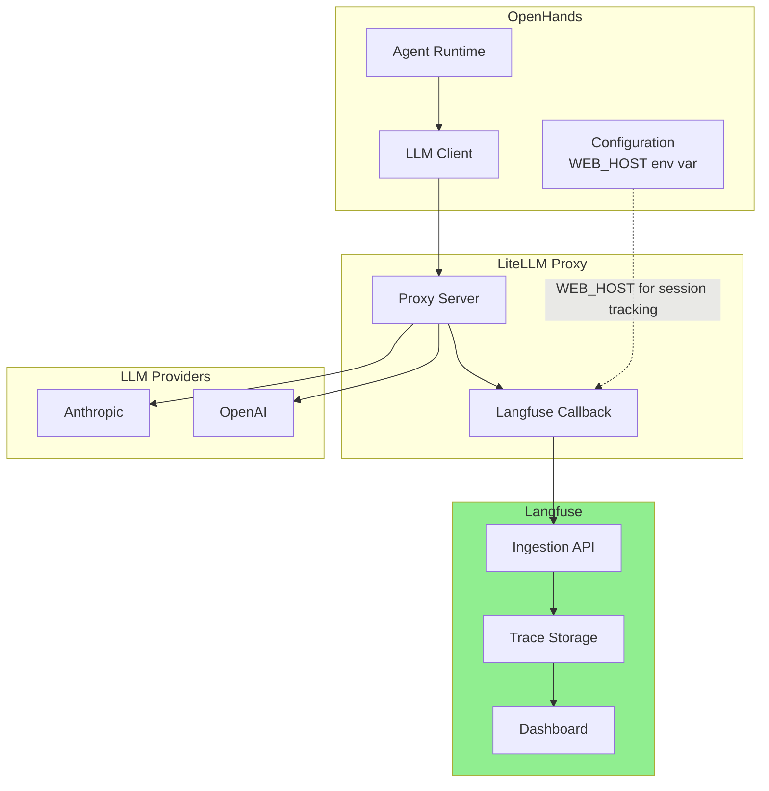
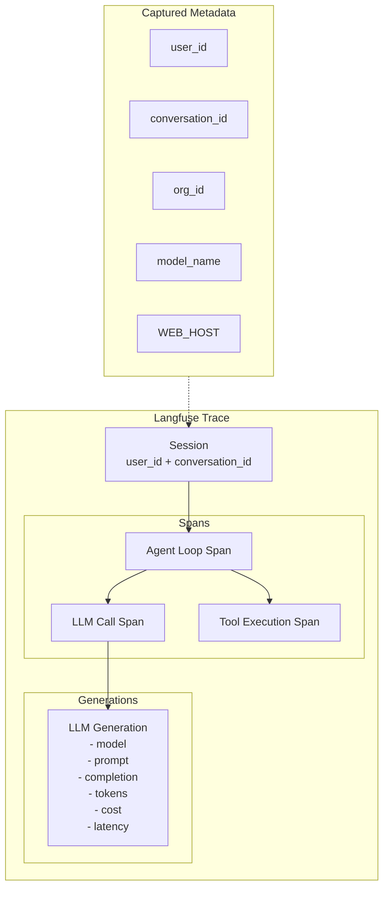
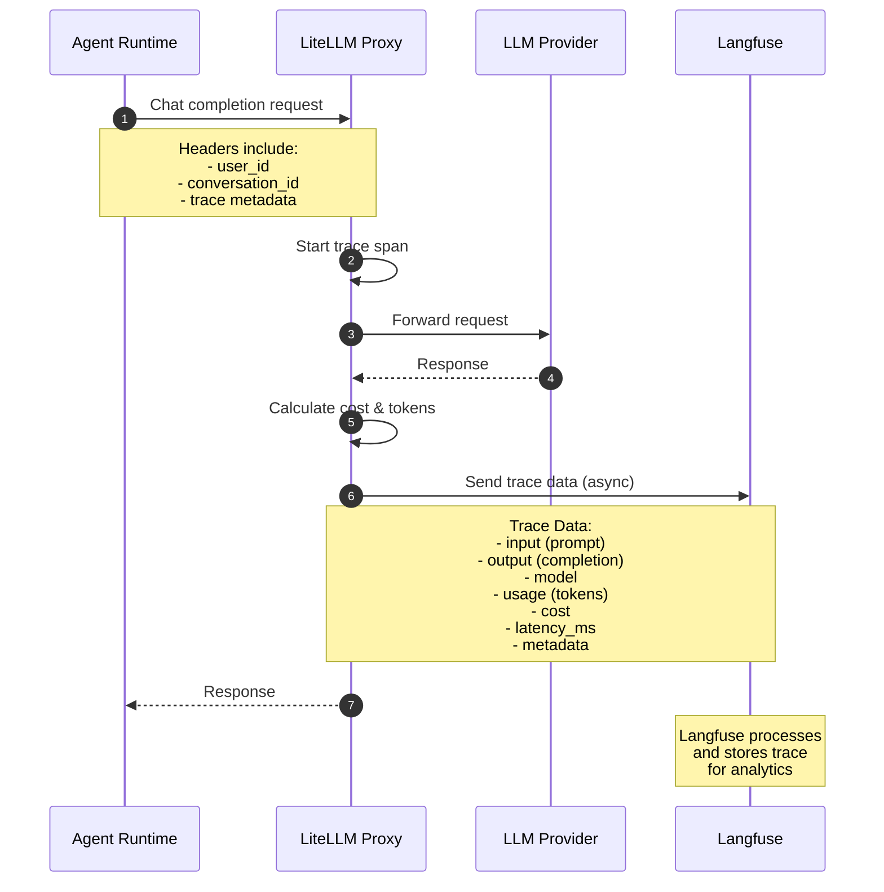
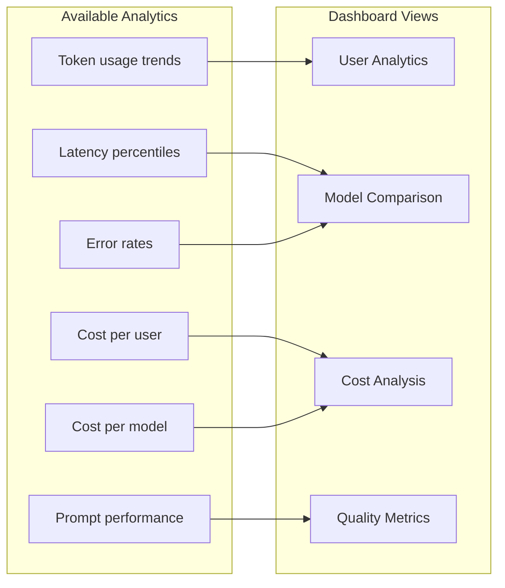
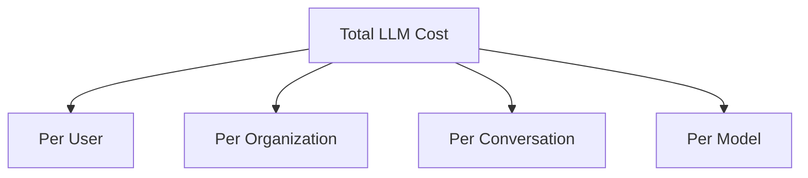

# Langfuse Integration

This document describes how OpenHands integrates with Langfuse for LLM observability and tracing.

## Overview

Langfuse provides LLM observability and tracing capabilities:
1. Request/response logging for LLM calls
2. Cost tracking and analytics
3. Latency monitoring
4. Prompt versioning and evaluation
5. User session tracking

## Architecture

### Integration Flow



### Trace Structure



### Data Flow



## Configuration

### Environment Variables

| Variable | Description | Required |
|----------|-------------|----------|
| `WEB_HOST` | Host identifier for session tracking | Yes |
| `LANGFUSE_PUBLIC_KEY` | Langfuse project public key | Yes (in LiteLLM) |
| `LANGFUSE_SECRET_KEY` | Langfuse project secret key | Yes (in LiteLLM) |
| `LANGFUSE_HOST` | Langfuse API host | Optional |

### Critical Configuration Note

From `enterprise/integrations/utils.py`:

```python
# ---- DO NOT REMOVE ----
# WARNING: Langfuse depends on the WEB_HOST environment variable being set to track events.
HOST = WEB_HOST
# ---- DO NOT REMOVE ----
```

The `WEB_HOST` environment variable is **critical** for Langfuse to properly track and correlate events across sessions.

## Metrics Captured

### Per-Request Metrics

| Metric | Description |
|--------|-------------|
| `latency_ms` | Total request latency |
| `prompt_tokens` | Input token count |
| `completion_tokens` | Output token count |
| `total_tokens` | Total tokens used |
| `cost_usd` | Estimated cost in USD |

### Aggregated Analytics



## Use Cases

### 1. Cost Attribution
Track LLM costs by user, organization, and conversation:



### 2. Quality Monitoring
Monitor response quality and detect issues:
- High latency requests
- Token limit exceeded
- Model errors
- Unexpected completions

### 3. Debugging
Trace individual requests for debugging:
- Full prompt/completion capture
- Request timing breakdown
- Error context

## Integration with LiteLLM

Langfuse is integrated via LiteLLM's callback system:

```python
# LiteLLM configuration (in proxy)
litellm.success_callback = ["langfuse"]
litellm.failure_callback = ["langfuse"]
```

This automatically sends all LLM calls to Langfuse without modifying application code.

## Related Files

- `enterprise/integrations/utils.py` - WEB_HOST configuration
- `enterprise/server/constants.py` - Environment configuration
- LiteLLM Proxy configuration (external)

## External Documentation

- [Langfuse Documentation](https://langfuse.com/docs)
- [LiteLLM + Langfuse Integration](https://docs.litellm.ai/docs/observability/langfuse_integration)
- [Langfuse Tracing](https://langfuse.com/docs/tracing)
