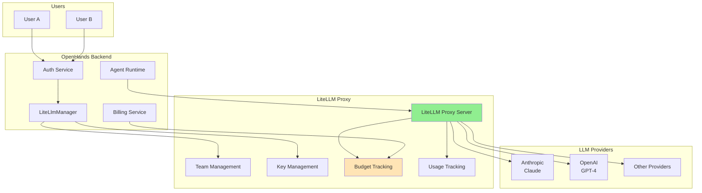
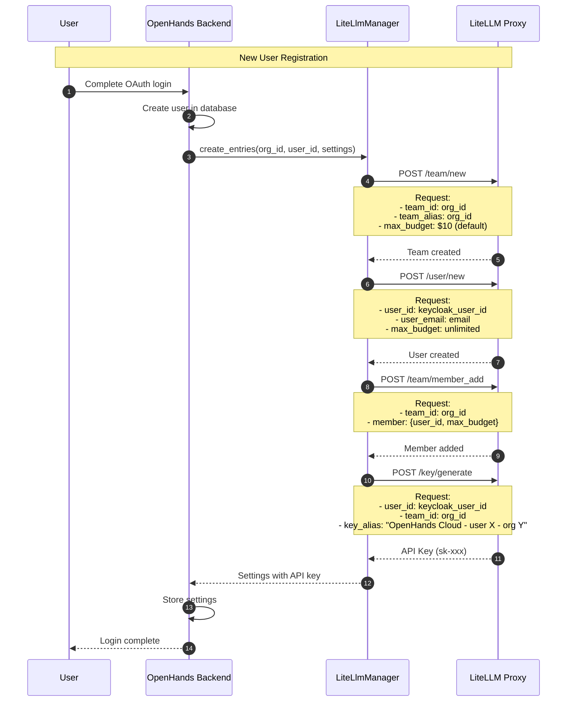
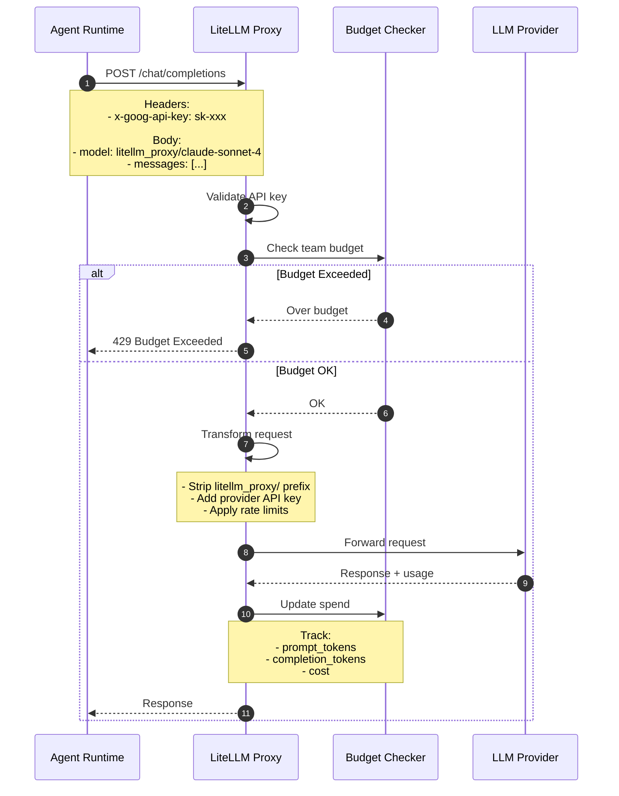
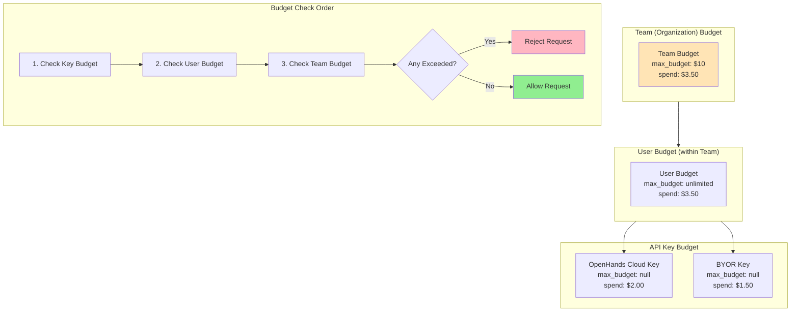
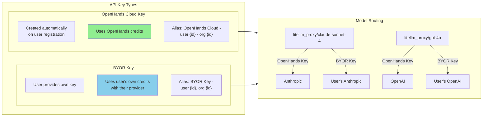
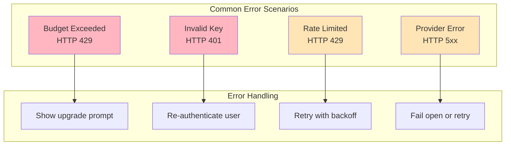

# LiteLLM Integration

This document describes how OpenHands integrates with LiteLLM for LLM API management, billing, and rate limiting.

## Overview

LiteLLM serves as our LLM proxy layer and handles:
1. Unified API for multiple LLM providers (OpenAI, Anthropic, etc.)
2. User/team budget management
3. API key generation and validation
4. Usage tracking and billing
5. Rate limiting

## Architecture

### High-Level Architecture



### User Onboarding Flow



### LLM Request Flow



### Budget Management



### Key Types



## Configuration

### Environment Variables

| Variable | Description | Example |
|----------|-------------|---------|
| `LITE_LLM_API_URL` | LiteLLM proxy URL | `https://llm-proxy.app.all-hands.dev` |
| `LITE_LLM_API_KEY` | Admin API key | `sk-xxx` |
| `LITE_LLM_TEAM_ID` | Default team ID | (optional) |
| `DEFAULT_INITIAL_BUDGET` | Starting budget for new users | `10` |
| `LITELLM_DEFAULT_MODEL` | Default model | `litellm_proxy/claude-sonnet-4-20250514` |

### Model Version Mapping

| Settings Version | Default Model |
|-----------------|---------------|
| 1 | `claude-3-5-sonnet-20241022` |
| 2 | `claude-3-7-sonnet-20250219` |
| 3 | `claude-sonnet-4-20250514` |
| 4 | `claude-sonnet-4-20250514` |
| 5 | `claude-opus-4-5-20251101` |

## LiteLlmManager API

The `LiteLlmManager` class provides:

### Team Operations
```python
await LiteLlmManager.create_team(keycloak_user_id, org_id, max_budget)
await LiteLlmManager.get_team(org_id)
await LiteLlmManager.update_team(org_id, max_budget)
await LiteLlmManager.delete_team(org_id)
```

### User Operations
```python
await LiteLlmManager.create_user(email, keycloak_user_id)
await LiteLlmManager.get_user(keycloak_user_id)
await LiteLlmManager.update_user(keycloak_user_id, max_budget)
await LiteLlmManager.delete_user(keycloak_user_id)
```

### Team Membership
```python
await LiteLlmManager.add_user_to_team(keycloak_user_id, org_id, max_budget)
await LiteLlmManager.remove_user_from_team(keycloak_user_id, org_id)
await LiteLlmManager.update_user_in_team(keycloak_user_id, org_id, max_budget)
```

### Key Operations
```python
await LiteLlmManager.generate_key(keycloak_user_id, org_id, key_alias, max_budget)
await LiteLlmManager.get_key_info(key)
await LiteLlmManager.verify_existing_key(key, keycloak_user_id, org_id)
await LiteLlmManager.delete_key(key_id, key_alias)
```

## Error Handling



## Related Files

- `enterprise/storage/lite_llm_manager.py` - LiteLLM API client
- `enterprise/server/constants.py` - Configuration and model mappings
- `enterprise/server/routes/billing.py` - Budget management endpoints
- `enterprise/server/routes/api_keys.py` - Key management endpoints
- `openhands/llm/llm.py` - LLM client (uses LiteLLM under the hood)

## External Documentation

- [LiteLLM Documentation](https://docs.litellm.ai/)
- [LiteLLM Proxy](https://docs.litellm.ai/docs/simple_proxy)
- [Budget Management](https://docs.litellm.ai/docs/proxy/users)
