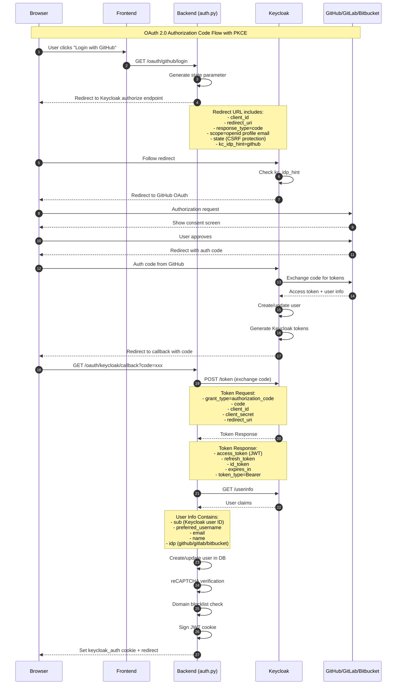
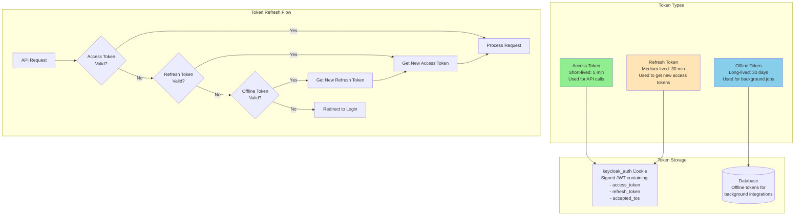
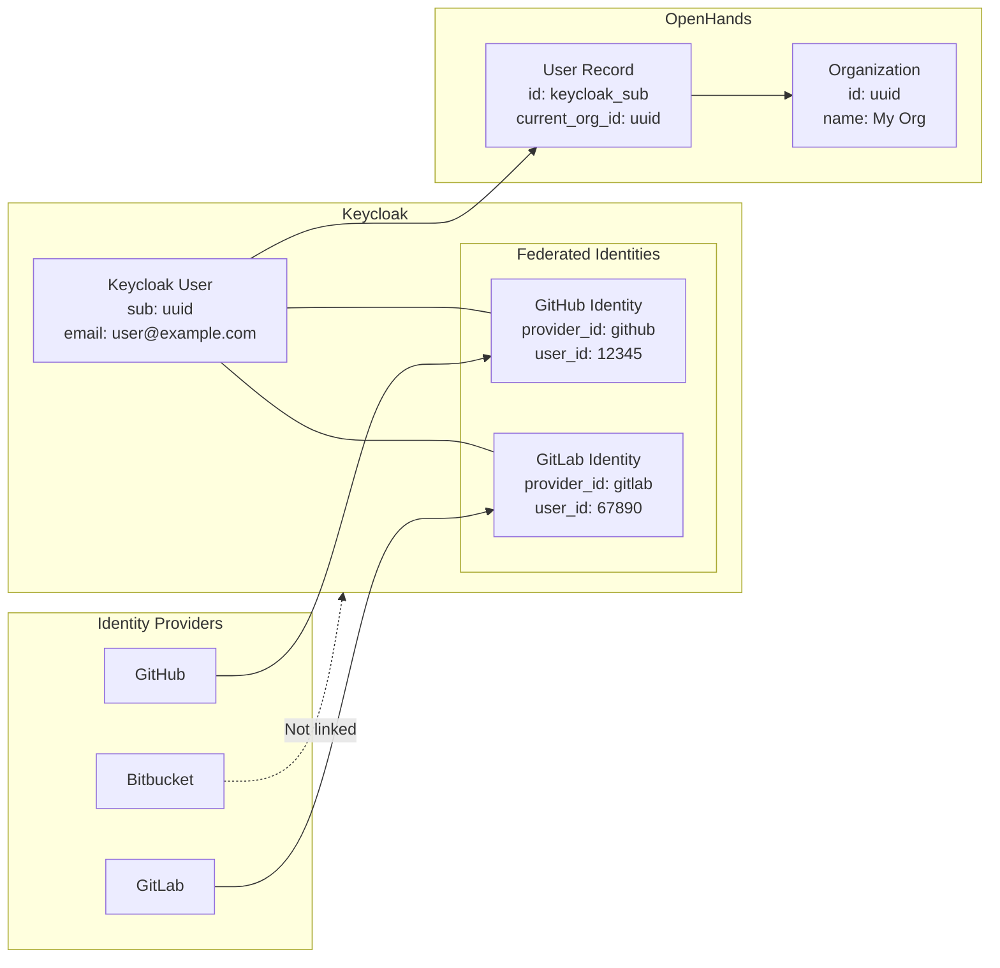
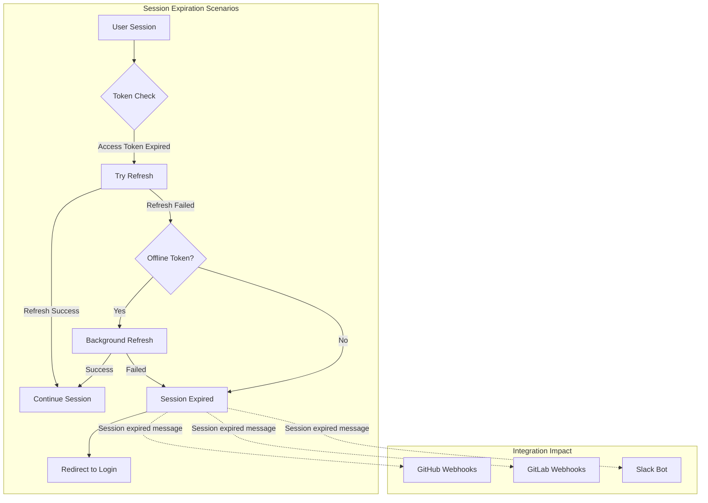

# Keycloak Integration

This document describes how OpenHands integrates with Keycloak for identity and access management.

## Overview

Keycloak serves as our identity provider (IdP) and handles:
1. User authentication via OAuth 2.0 / OpenID Connect
2. Social login federation (GitHub, GitLab, Bitbucket)
3. Token management (access tokens, refresh tokens, offline tokens)
4. User account management
5. Session management

## Architecture

### Authentication Flow



### Token Management



### User Identity Linking



## Configuration

### Environment Variables

| Variable | Description | Example |
|----------|-------------|---------|
| `KEYCLOAK_SERVER_URL` | Internal Keycloak URL | `http://keycloak:8080` |
| `KEYCLOAK_SERVER_URL_EXT` | External Keycloak URL | `https://auth.all-hands.dev` |
| `KEYCLOAK_REALM_NAME` | Realm name | `openhands` |
| `KEYCLOAK_CLIENT_ID` | OAuth client ID | `openhands-web` |
| `KEYCLOAK_CLIENT_SECRET` | OAuth client secret | `***` |
| `KEYCLOAK_PROVIDER_NAME` | Default IdP hint | `github` |
| `KEYCLOAK_ADMIN_PASSWORD` | Admin API password | `***` |

### Keycloak Realm Configuration

The realm should be configured with:
- Identity Providers: GitHub, GitLab, Bitbucket
- Client: Web application with authorization code flow
- Token settings: Access token (5 min), Refresh token (30 min), Offline session (30 days)

## Token Manager

The `TokenManager` class (`token_manager.py`) provides:

```python
class TokenManager:
    async def get_keycloak_tokens(code, redirect_uri) -> tuple[str, str]
    async def refresh_tokens(refresh_token) -> tuple[str, str]
    async def get_user_info(access_token) -> dict
    async def get_user_info_from_user_id(user_id) -> dict
    async def disable_keycloak_user(user_id, email) -> None
    async def delete_keycloak_user(user_id) -> bool
```

## Session Expiration



When a session expires, integrations show:
> "Your session has expired. Please login again at OpenHands Cloud and try again."

## Security Considerations

### Token Security
- Access tokens are short-lived (5 min) to minimize exposure
- Refresh tokens are stored in HTTP-only, secure cookies
- Tokens are signed with a server-side secret

### CSRF Protection
- State parameter in OAuth flow prevents CSRF attacks
- SameSite cookie attribute set appropriately per environment

### Session Hijacking Prevention
- Cookies are HTTP-only (no JavaScript access)
- Secure flag set in production
- Domain-scoped cookies

## Related Files

- `enterprise/server/auth/keycloak_manager.py` - Keycloak client singletons
- `enterprise/server/auth/token_manager.py` - Token operations
- `enterprise/server/auth/saas_user_auth.py` - User authentication logic
- `enterprise/server/routes/auth.py` - OAuth endpoints
- `enterprise/server/middleware.py` - Request authentication

## External Documentation

- [Keycloak Documentation](https://www.keycloak.org/documentation)
- [OpenID Connect Spec](https://openid.net/connect/)
- [OAuth 2.0 RFC 6749](https://tools.ietf.org/html/rfc6749)
