# reCAPTCHA Enterprise Integration

This document describes how OpenHands integrates with Google reCAPTCHA Enterprise for bot detection and fraud prevention during user login.

## Overview

We use reCAPTCHA Enterprise with Account Defender to:
1. Detect automated/bot login attempts
2. Identify suspicious account patterns
3. Block low-confidence login attempts while allowing legitimate users

## Architecture

### Sequence Diagram

```mermaid
sequenceDiagram
    autonumber
    participant Browser
    participant Frontend
    participant Backend as Backend (auth.py)
    participant RecaptchaService as RecaptchaService
    participant Google as Google reCAPTCHA Enterprise

    Note over Browser,Google: User Login Flow with reCAPTCHA Enterprise

    %% Frontend Token Generation
    Browser->>Frontend: User clicks "Login with GitHub"
    Frontend->>Google: Load reCAPTCHA script (site_key)
    Google-->>Frontend: reCAPTCHA widget ready
    Frontend->>Google: grecaptcha.execute(site_key, {action: 'LOGIN'})
    
    Note over Frontend,Google: Google collects browser signals:<br/>- Mouse movements<br/>- Typing patterns<br/>- Browser fingerprint<br/>- JavaScript behavior
    
    Google-->>Frontend: reCAPTCHA token (encrypted)
    Frontend->>Backend: OAuth callback + recaptcha_token (cookie/param)

    %% Backend Processing
    Backend->>Backend: Extract IP from headers
    Note over Backend: IP Logic:<br/>1. Try X-Forwarded-For (first IP)<br/>2. Fallback to request.client.host<br/>3. Fallback to 'unknown'
    
    Backend->>Backend: Extract User-Agent header

    %% reCAPTCHA Assessment
    Backend->>RecaptchaService: create_assessment(token, action, user_ip, user_agent, email)
    
    RecaptchaService->>Google: CreateAssessmentRequest
    
    Note over RecaptchaService,Google: Data Sent to Google:<br/>━━━━━━━━━━━━━━━━━━━━━<br/>• site_key: "6Lc..."<br/>• token: "03AGdBq..."<br/>• user_ip_address: "203.0.113.45"<br/>• user_agent: "Mozilla/5.0..."<br/>• expected_action: "LOGIN"<br/>• user_info.account_id: HMAC-SHA256(email)<br/>• user_info.user_ids[].email: "user@example.com"

    Google-->>RecaptchaService: Assessment Response
    
    Note over RecaptchaService,Google: Data Received from Google:<br/>━━━━━━━━━━━━━━━━━━━━━━━━<br/>• name: "projects/.../assessments/abc123"<br/>• token_properties.valid: true/false<br/>• token_properties.action: "LOGIN"<br/>• risk_analysis.score: 0.0-1.0<br/>• risk_analysis.reasons: ["AUTOMATION", ...]<br/>• account_defender_assessment.labels:<br/>  ["SUSPICIOUS_LOGIN_ACTIVITY", ...]

    RecaptchaService->>RecaptchaService: Evaluate Response
    
    Note over RecaptchaService: Decision Logic:<br/>━━━━━━━━━━━━━━━━<br/>allowed = (<br/>  valid == true AND<br/>  action == "LOGIN" AND<br/>  score >= 0.3 AND<br/>  no suspicious labels<br/>)

    RecaptchaService-->>Backend: AssessmentResult

    %% Decision Tree
    alt Token Missing
        Backend->>Backend: Log: recaptcha_token_missing
        Backend->>Backend: Store LoginEvent(outcome=BLOCKED_NO_TOKEN)
        Backend-->>Browser: Redirect to /login?recaptcha_blocked=true
    else Assessment allowed=false
        Backend->>Backend: Log: recaptcha_blocked_at_callback
        Backend->>Backend: Store LoginEvent(outcome=BLOCKED_RECAPTCHA)
        Backend-->>Browser: Redirect to /login?recaptcha_blocked=true
    else Assessment allowed=true
        Backend->>Backend: Store LoginEvent(outcome=ALLOWED)
        Backend->>Backend: Continue with login flow
        Backend->>Backend: Check domain blocklist
        alt Domain blocked
            Backend-->>Browser: Redirect with domain_blocked error
        else Domain allowed
            Backend->>Backend: Create/update user session
            Backend-->>Browser: Set JWT cookie, redirect to app
        end
    else reCAPTCHA Service Error
        Backend->>Backend: Log exception
        Backend->>Backend: Store LoginEvent(outcome=ERROR)
        Backend->>Backend: FAIL OPEN - Continue login
        Backend-->>Browser: Set JWT cookie, redirect to app
    end
```



### Data Flow Diagram

```mermaid
flowchart TB
    subgraph Frontend ["Frontend (Browser)"]
        A[User Action] --> B[reCAPTCHA Widget]
        B -->|Collects| C[Browser Signals]
        C --> D[Generate Token]
    end

    subgraph Backend ["Backend Server"]
        E[OAuth Callback Handler]
        F[Extract Request Context]
        G[RecaptchaService]
        H{Decision Engine}
        I[LoginEventStore]
    end

    subgraph Google ["Google reCAPTCHA Enterprise"]
        J[Assessment API]
        K[Account Defender]
        L[Risk Analysis]
    end

    subgraph DataSent ["Data We Send →"]
        M1[site_key]
        M2[token]
        M3[user_ip_address]
        M4[user_agent]
        M5[expected_action]
        M6[user_info.account_id<br/>HMAC-SHA256 of email]
        M7[user_info.user_ids.email]
    end

    subgraph DataReceived ["← Data We Receive"]
        N1[assessment.name]
        N2[token_properties.valid]
        N3[token_properties.action]
        N4[risk_analysis.score<br/>0.0 = bot, 1.0 = human]
        N5[risk_analysis.reasons<br/>AUTOMATION, TOO_MUCH_TRAFFIC, etc.]
        N6[account_defender_assessment.labels<br/>SUSPICIOUS_LOGIN_ACTIVITY, etc.]
    end

    subgraph Outcomes ["Possible Outcomes"]
        O1[✅ ALLOWED<br/>Login proceeds]
        O2[❌ BLOCKED_RECAPTCHA<br/>Score < 0.3 or invalid]
        O3[❌ BLOCKED_NO_TOKEN<br/>Missing token]
        O4[⚠️ ERROR<br/>Service unavailable, fail open]
    end

    D -->|Token in Cookie| E
    E --> F
    F -->|IP, User-Agent| G
    G -->|CreateAssessmentRequest| J
    
    M1 & M2 & M3 & M4 & M5 & M6 & M7 -.-> J
    
    J --> K
    J --> L
    K & L -->|Response| G
    
    N1 & N2 & N3 & N4 & N5 & N6 -.-> G
    
    G --> H
    H -->|valid AND score>=0.3<br/>AND no suspicious labels| O1
    H -->|invalid OR score<0.3<br/>OR suspicious labels| O2
    H -->|No token| O3
    H -->|Exception| O4
    
    O1 & O2 & O3 & O4 --> I

    style O1 fill:#90EE90
    style O2 fill:#FFB6C1
    style O3 fill:#FFB6C1
    style O4 fill:#FFE4B5
```



### Account Defender Labels


## Data Reference

### Data Sent to Google

| Field | Source | Description |
|-------|--------|-------------|
| `site_key` | `RECAPTCHA_SITE_KEY` env var | Public reCAPTCHA site identifier |
| `token` | Frontend cookie/param | Encrypted token from reCAPTCHA widget |
| `user_ip_address` | `X-Forwarded-For` or `request.client.host` | User's IP address |
| `user_agent` | `User-Agent` header | Browser user agent string |
| `expected_action` | Hardcoded `"LOGIN"` | Action name for validation |
| `user_info.account_id` | HMAC-SHA256 of email | Hashed account identifier for Account Defender |
| `user_info.user_ids[].email` | User's email | Plain email for fraud correlation |

### Data Received from Google

| Field | Type | Description |
|-------|------|-------------|
| `name` | string | Assessment resource name (e.g., `projects/xxx/assessments/yyy`) |
| `token_properties.valid` | boolean | Whether the token is valid and not expired |
| `token_properties.action` | string | Action embedded in token (should match expected) |
| `risk_analysis.score` | float | Risk score: 0.0 (likely bot) to 1.0 (likely human) |
| `risk_analysis.reasons` | string[] | Classification reasons (see below) |
| `account_defender_assessment.labels` | string[] | Account Defender labels (see below) |

### Risk Analysis Reasons

| Reason | Description |
|--------|-------------|
| `AUTOMATION` | Interactions matched automated agent behavior |
| `UNEXPECTED_ENVIRONMENT` | Request from illegitimate environment |
| `TOO_MUCH_TRAFFIC` | Traffic volume higher than normal |
| `UNEXPECTED_USAGE_PATTERNS` | Significantly different usage patterns |
| `LOW_CONFIDENCE_SCORE` | Insufficient traffic history |
| `SUSPECTED_CARDING` | Matches carding attack patterns |
| `SUSPECTED_CHARGEBACK` | Matches chargeback fraud patterns |

### Account Defender Labels

| Label | Action | Description |
|-------|--------|-------------|
| `PROFILE_MATCH` | None (informational) | Request matches known good profile |
| `SUSPICIOUS_LOGIN_ACTIVITY` | **Block** | Login from unusual location/device |
| `SUSPICIOUS_ACCOUNT_CREATION` | **Block** | Account creation matches fraud patterns |
| `RELATED_ACCOUNTS_NUMBER_HIGH` | **Block** | Many related accounts detected |

## Decision Logic

A login is **allowed** if ALL of the following are true:

```python
allowed = (
    token_properties.valid == True
    AND token_properties.action == "LOGIN"
    AND risk_analysis.score >= RECAPTCHA_BLOCK_THRESHOLD  # default: 0.3
    AND account_defender_labels ∩ SUSPICIOUS_LABELS == ∅
)
```

Where `SUSPICIOUS_LABELS` = `{SUSPICIOUS_LOGIN_ACTIVITY, SUSPICIOUS_ACCOUNT_CREATION, RELATED_ACCOUNTS_NUMBER_HIGH}`

## Configuration

| Environment Variable | Default | Description |
|---------------------|---------|-------------|
| `RECAPTCHA_PROJECT_ID` | (required) | Google Cloud project ID |
| `RECAPTCHA_SITE_KEY` | (required) | reCAPTCHA site key |
| `RECAPTCHA_HMAC_SECRET` | (required) | Secret for hashing account IDs |
| `RECAPTCHA_BLOCK_THRESHOLD` | `0.3` | Minimum score to allow login |

## Logging

All assessments are logged with the following fields:

```json
{
  "message": "recaptcha_assessment",
  "assessment_name": "projects/xxx/assessments/yyy",
  "score": 0.9,
  "valid": true,
  "action_valid": true,
  "reasons": [],
  "account_defender_labels": ["PROFILE_MATCH"],
  "has_suspicious_labels": false,
  "allowed": true,
  "user_ip": "203.0.113.45"
}
```

## Login Event Storage

All login attempts (blocked and allowed) are stored in the `login_events` table for:
- Annotation feedback to Google (improves model)
- False positive detection
- Audit trail

See `LoginEventStore` for query methods.

## Security Considerations

### IP Address Extraction

⚠️ **Current implementation extracts IP from `X-Forwarded-For` header**, which can be spoofed by attackers if the header is not properly sanitized by upstream proxies.

```python
# Current logic (auth.py lines 241-244)
user_ip = request.client.host if request.client else 'unknown'
forwarded_for = request.headers.get('X-Forwarded-For')
if forwarded_for:
    user_ip = forwarded_for.split(',')[0].strip()  # Takes first IP
```

**Recommendations:**
1. Ensure load balancer overwrites (not appends to) `X-Forwarded-For`
2. Consider using `X-Real-IP` from trusted proxy
3. Configure trusted proxy hops if using multiple proxies

### User-Agent Spoofing

The `User-Agent` header can be trivially spoofed. reCAPTCHA uses it as one of many signals but doesn't rely on it solely.

## Related Files

- `enterprise/server/auth/recaptcha_service.py` - Core service implementation
- `enterprise/server/auth/constants.py` - Configuration constants
- `enterprise/server/routes/auth.py` - OAuth callback with reCAPTCHA check
- `enterprise/storage/login_event.py` - LoginEvent model
- `enterprise/storage/login_event_store.py` - LoginEvent queries

## External Documentation

- [reCAPTCHA Enterprise Documentation](https://cloud.google.com/recaptcha/docs)
- [Assessment API Reference](https://cloud.google.com/recaptcha/docs/reference/rest/v1/projects.assessments)
- [Account Defender](https://cloud.google.com/recaptcha/docs/account-defender)
- [Interpreting Scores](https://cloud.google.com/recaptcha/docs/interpret-assessment)
