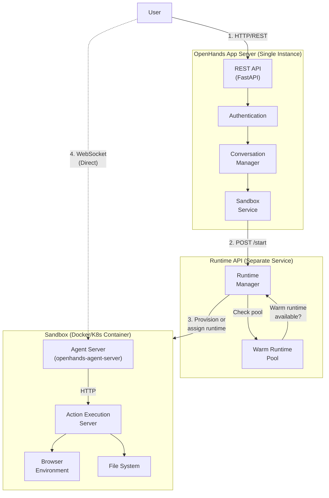
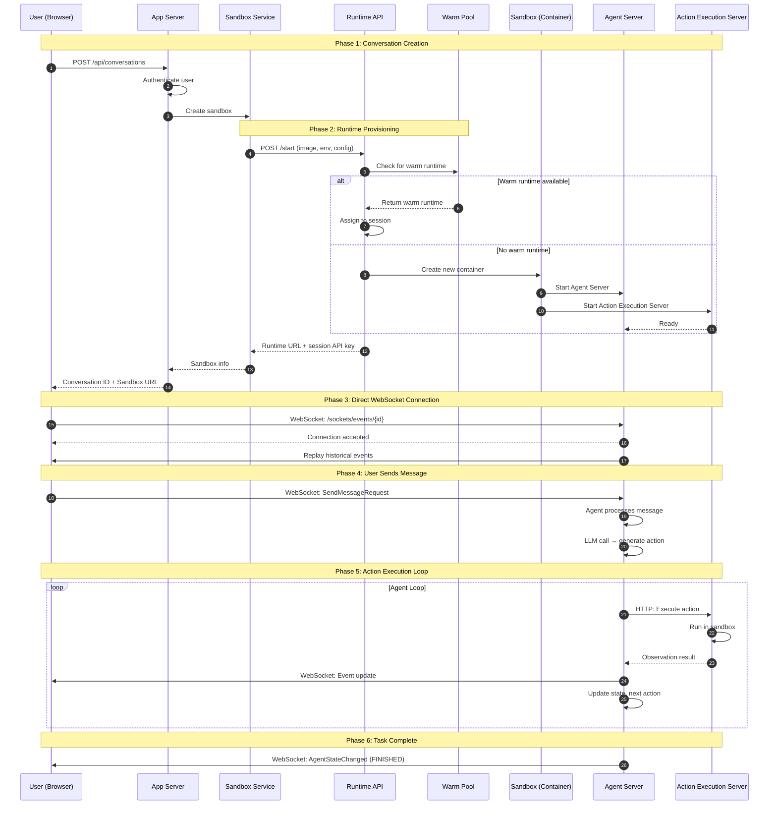
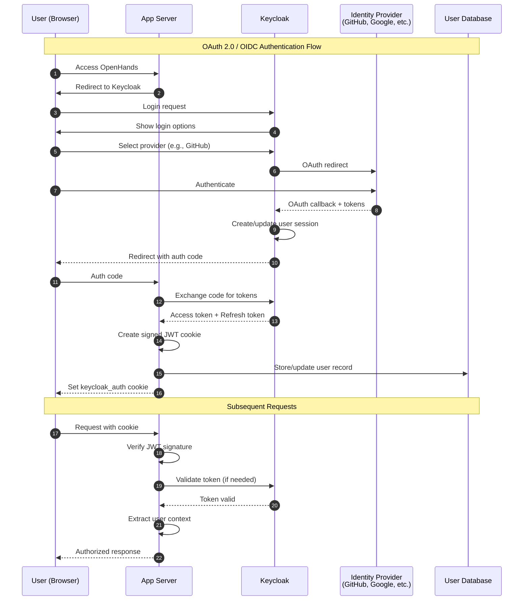
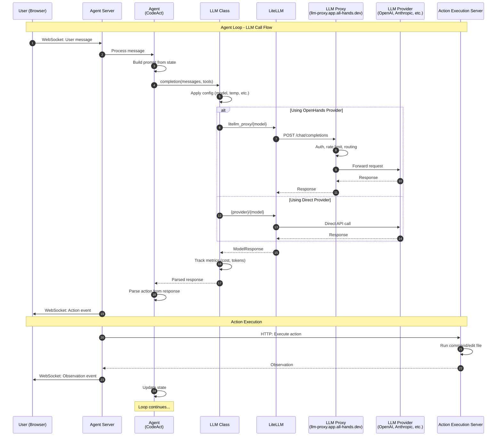
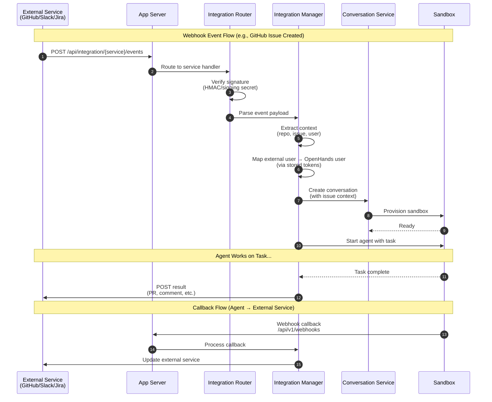
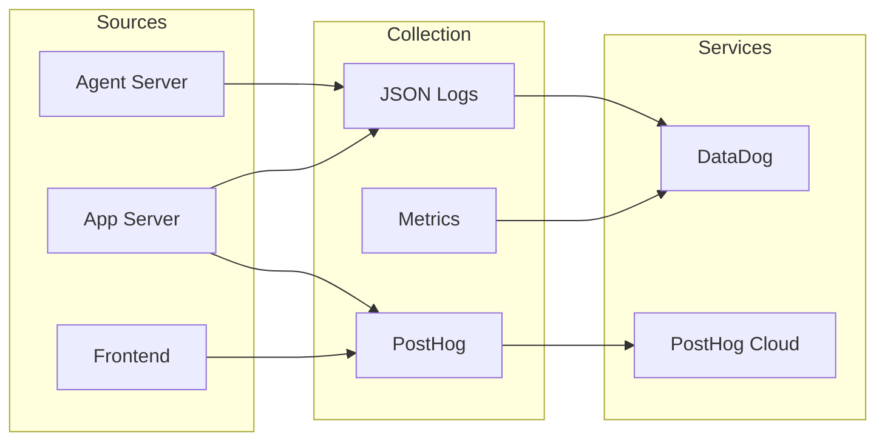

# OpenHands Architecture

This document provides detailed architecture diagrams and explanations for the OpenHands system.

## Table of Contents

- [System Architecture Overview](#system-architecture-overview)
- [Conversation Startup & WebSocket Flow](#conversation-startup--websocket-flow)
- [Authentication Flow](#authentication-flow)
- [Agent Execution & LLM Flow](#agent-execution--llm-flow)
- [External Integrations](#external-integrations)
- [Metrics, Logs & Observability](#metrics-logs--observability)

---

## System Architecture Overview

OpenHands uses a multi-tier architecture with these main components:



### Component Responsibilities

| Component | Location | Instances | Purpose |
|-----------|----------|-----------|---------|
| **App Server** | Host | 1 per deployment | REST API, auth, conversation management |
| **Sandbox Service** | Inside App Server | 1 | Manages sandbox lifecycle, calls Runtime API |
| **Runtime API** | Separate service | 1 per deployment | Provisions runtimes, manages warm pool |
| **Agent Server** | Inside sandbox | 1 per sandbox | AI agent loop, LLM calls, state management |
| **Action Execution Server** | Inside sandbox | 1 per sandbox | Execute bash, file ops, browser actions |

### Runtime API Endpoints

The Runtime API manages the actual container/pod lifecycle:

| Endpoint | Purpose |
|----------|---------|
| `POST /start` | Start a new runtime (or assign from warm pool) |
| `POST /stop` | Stop and clean up a runtime |
| `POST /pause` | Pause a running runtime |
| `POST /resume` | Resume a paused runtime |
| `GET /sessions/{id}` | Get runtime status |
| `GET /list` | List all active runtimes |

## Conversation Startup & WebSocket Flow

When a user starts a conversation, this sequence occurs:



### Key Points

1. **Initial Setup via App Server**: The App Server handles authentication and coordinates with the Sandbox Service
2. **Runtime API Provisioning**: The Sandbox Service calls the Runtime API, which checks for warm runtimes before creating new containers
3. **Warm Pool Optimization**: Pre-warmed runtimes reduce startup latency significantly
4. **Direct WebSocket to Sandbox**: Once created, the user's browser connects **directly** to the Agent Server inside the sandbox
5. **App Server Not in Hot Path**: After connection, all real-time communication bypasses the App Server entirely
6. **Agent Server Orchestrates**: The Agent Server manages the AI loop, calling the Action Execution Server for actual command execution

## Authentication Flow

OpenHands uses Keycloak for identity management in the SaaS deployment. The authentication flow involves multiple services:



### Authentication Components

| Component | Purpose | Location |
|-----------|---------|----------|
| **Keycloak** | Identity provider, SSO, token management | External service |
| **UserAuth** | Abstract auth interface | `openhands/server/user_auth/user_auth.py` |
| **SaasUserAuth** | Keycloak implementation | `enterprise/server/auth/saas_user_auth.py` |
| **JWT Service** | Token signing/verification | `openhands/app_server/services/jwt_service.py` |
| **Auth Routes** | Login/logout endpoints | `enterprise/server/routes/auth.py` |

### Token Flow

1. **Keycloak Access Token**: Short-lived token for API access
2. **Keycloak Refresh Token**: Long-lived token to obtain new access tokens
3. **Signed JWT Cookie**: App Server's session cookie containing encrypted Keycloak tokens
4. **Provider Tokens**: OAuth tokens for GitHub, GitLab, etc. (stored separately for git operations)

## Agent Execution & LLM Flow

When the agent executes inside the sandbox, it makes LLM calls through LiteLLM:



### LLM Components

| Component | Purpose | Location |
|-----------|---------|----------|
| **LLM Class** | Wrapper with retries, metrics, config | `openhands/llm/llm.py` |
| **LiteLLM** | Universal LLM API adapter | External library |
| **LLM Proxy** | OpenHands managed proxy for billing/routing | `llm-proxy.app.all-hands.dev` |
| **LLM Registry** | Manages multiple LLM instances | `openhands/llm/llm_registry.py` |

### Model Routing

```
User selects model
        │
        ▼
┌───────────────────┐
│ Model prefix?     │
└───────────────────┘
        │
        ├── openhands/claude-3-5  ──► Rewrite to litellm_proxy/claude-3-5
        │                              Base URL: llm-proxy.app.all-hands.dev
        │
        ├── anthropic/claude-3-5  ──► Direct to Anthropic API
        │                              (User's API key)
        │
        ├── openai/gpt-4          ──► Direct to OpenAI API
        │                              (User's API key)
        │
        └── azure/gpt-4           ──► Direct to Azure OpenAI
                                       (User's API key + endpoint)
```

### LLM Proxy Benefits

When using `openhands/` prefixed models:
- **Unified Billing**: Costs tracked through OpenHands account
- **No API Keys Needed**: Users don't need their own provider keys
- **Rate Limiting**: Managed quotas and throttling
- **Model Routing**: Automatic failover and load balancing
- **Usage Tracking**: Detailed metrics and cost analysis

## External Integrations

OpenHands integrates with external services (GitHub, Slack, Jira, etc.) through webhook-based event handling:



### Supported Integrations

| Integration | Trigger Events | Agent Actions |
|-------------|----------------|---------------|
| **GitHub** | Issue created, PR opened, @mention | Create PR, comment, push commits |
| **GitLab** | Issue created, MR opened | Create MR, comment, push commits |
| **Slack** | @mention in channel | Reply in thread, create tasks |
| **Jira** | Issue created/updated | Update ticket, add comments |
| **Linear** | Issue created | Update status, add comments |

### Integration Components

| Component | Purpose | Location |
|-----------|---------|----------|
| **Integration Routes** | Webhook endpoints per service | `enterprise/server/routes/integration/` |
| **Integration Managers** | Business logic per service | `enterprise/integrations/{service}/` |
| **Token Manager** | Store/retrieve OAuth tokens | `enterprise/server/auth/token_manager.py` |
| **Callback Processor** | Handle agent → service updates | `enterprise/integrations/{service}/*_callback_processor.py` |

### Integration Authentication

```
External Service (e.g., GitHub)
        │
        ▼
┌─────────────────────────────────┐
│ GitHub App Installation         │
│ - Webhook secret for signature  │
│ - App private key for API calls │
└─────────────────────────────────┘
        │
        ▼
┌─────────────────────────────────┐
│ User Account Linking            │
│ - Keycloak user ID              │
│ - GitHub user ID                │
│ - Stored OAuth tokens           │
└─────────────────────────────────┘
        │
        ▼
┌─────────────────────────────────┐
│ Agent Execution                 │
│ - Uses linked tokens for API    │
│ - Can push, create PRs, comment │
└─────────────────────────────────┘
```

## Metrics, Logs & Observability

OpenHands uses multiple systems for monitoring, analytics, and debugging:



### Logging Infrastructure

| Component | Format | Destination | Purpose |
|-----------|--------|-------------|---------|
| **Application Logs** | JSON (when `LOG_JSON=1`) | stdout → DataDog | Debugging, error tracking |
| **Access Logs** | JSON (Uvicorn) | stdout → DataDog | Request tracing |
| **LLM Debug Logs** | Plain text | File (optional) | LLM call debugging |

### JSON Log Format

When `LOG_JSON=1` is set, all logs are emitted as single-line JSON for DataDog ingestion:

```json
{
  "message": "Conversation started",
  "severity": "INFO",
  "conversation_id": "abc-123",
  "user_id": "user-456",
  "timestamp": "2024-01-15T10:30:00Z"
}
```

### Metrics Tracked

| Metric | Tracked By | Storage | Purpose |
|--------|------------|---------|---------|
| **LLM Cost** | `Metrics` class | Conversation stats file | Billing, budget limits |
| **Token Usage** | `Metrics` class | Conversation stats file | Usage analytics |
| **Response Latency** | `Metrics` class | Conversation stats file | Performance monitoring |
| **User Events** | PostHog | PostHog Cloud | Product analytics |
| **Feature Flags** | PostHog | PostHog Cloud | Gradual rollouts |

### PostHog Analytics

PostHog is used for both product analytics and feature flags:

**Frontend Events:**
- `conversation_started`
- `download_trajectory_button_clicked`
- Feature flag checks

**Backend Events:**
- Experiment assignments
- Conversion tracking

### DataDog Integration

Logs are ingested by DataDog through structured JSON output:

1. **Log Collection**: Container stdout/stderr → DataDog Agent → DataDog Logs
2. **APM Traces**: Distributed tracing across services (when enabled)
3. **Dashboards**: Custom dashboards for:
   - Error rates by service
   - Request latency percentiles
   - Conversation success rates
   - LLM cost tracking

### Conversation Stats Persistence

Per-conversation metrics are persisted for billing and analytics:

```python
# Location: openhands/server/services/conversation_stats.py
ConversationStats:
  - service_to_metrics: Dict[str, Metrics]
  - accumulated_cost: float
  - token_usage: TokenUsage
  
# Stored at: {file_store}/conversation_stats/{conversation_id}.pkl
```
