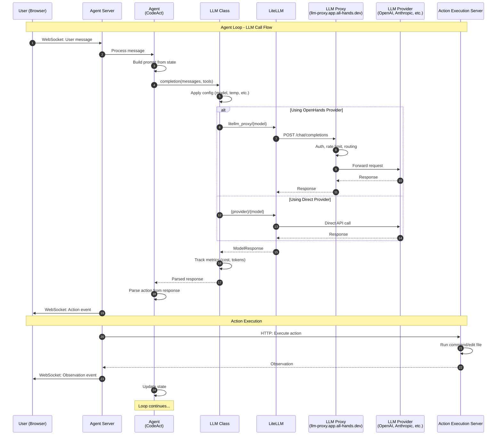

# Agent Execution & LLM Flow

When the agent executes inside the sandbox, it makes LLM calls through LiteLLM:



### LLM Components

| Component | Purpose | Location |
|-----------|---------|----------|
| **LLM Class** | Wrapper with retries, metrics, config | `openhands/llm/llm.py` |
| **LiteLLM** | Universal LLM API adapter | External library |
| **LLM Proxy** | OpenHands managed proxy for billing/routing | `llm-proxy.app.all-hands.dev` |
| **LLM Registry** | Manages multiple LLM instances | `openhands/llm/llm_registry.py` |

### Model Routing

```
User selects model
        │
        ▼
┌───────────────────┐
│ Model prefix?     │
└───────────────────┘
        │
        ├── openhands/claude-3-5  ──► Rewrite to litellm_proxy/claude-3-5
        │                              Base URL: llm-proxy.app.all-hands.dev
        │
        ├── anthropic/claude-3-5  ──► Direct to Anthropic API
        │                              (User's API key)
        │
        ├── openai/gpt-4          ──► Direct to OpenAI API
        │                              (User's API key)
        │
        └── azure/gpt-4           ──► Direct to Azure OpenAI
                                       (User's API key + endpoint)
```

### LLM Proxy

When using `openhands/` prefixed models, requests are routed through a managed proxy.
See the [OpenHands documentation](https://docs.openhands.dev/) for details on supported models.
