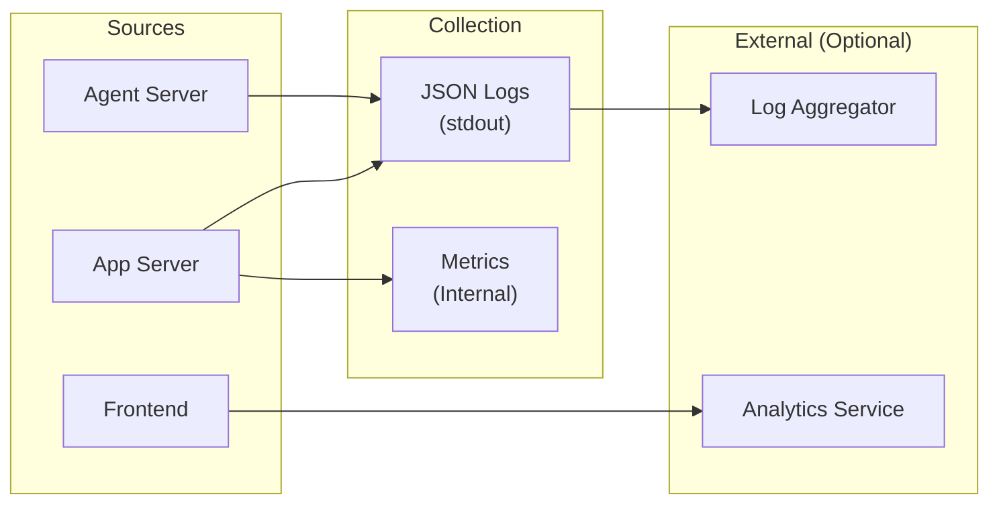

# Observability

OpenHands provides structured logging and metrics collection for monitoring and debugging.

> **SDK Documentation**: For detailed guidance on observability and metrics in agent development, see:
> - [SDK Observability Guide](https://docs.openhands.dev/sdk/guides/observability)
> - [SDK Metrics Guide](https://docs.openhands.dev/sdk/guides/metrics)



### Structured Logging

OpenHands uses Python's standard logging library with structured JSON output support.

| Component | Format | Destination | Purpose |
|-----------|--------|-------------|---------|
| **Application Logs** | JSON (when `LOG_JSON=1`) | stdout | Debugging, error tracking |
| **Access Logs** | JSON (Uvicorn) | stdout | Request tracing |
| **LLM Debug Logs** | Plain text | File (optional) | LLM call debugging |

### JSON Log Format

When `LOG_JSON=1` is set, logs are emitted as single-line JSON for ingestion by log aggregators:

```json
{
  "message": "Conversation started",
  "severity": "INFO",
  "conversation_id": "abc-123",
  "user_id": "user-456",
  "timestamp": "2024-01-15T10:30:00Z"
}
```

Additional context can be added using Python's logger `extra=` parameter (see [Python logging docs](https://docs.python.org/3/library/logging.html)).

### Metrics

| Metric | Tracked By | Storage | Purpose |
|--------|------------|---------|---------|
| **LLM Cost** | `Metrics` class | Conversation stats file | Billing, budget limits |
| **Token Usage** | `Metrics` class | Conversation stats file | Usage analytics |
| **Response Latency** | `Metrics` class | Conversation stats file | Performance monitoring |

### Conversation Stats Persistence

Per-conversation metrics are persisted for analytics:

```python
# Location: openhands/server/services/conversation_stats.py
ConversationStats:
  - service_to_metrics: Dict[str, Metrics]
  - accumulated_cost: float
  - token_usage: TokenUsage

# Stored at: {file_store}/conversation_stats/{conversation_id}.pkl
```

### Integration with External Services

Structured JSON logging allows integration with any log aggregation service (e.g., ELK Stack, Loki, Splunk). Configure your log collector to ingest from container stdout/stderr.
