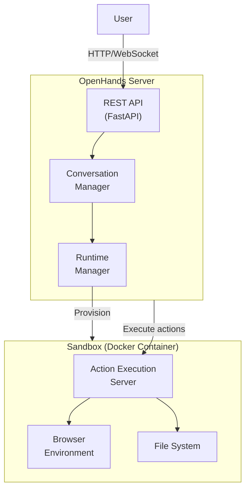
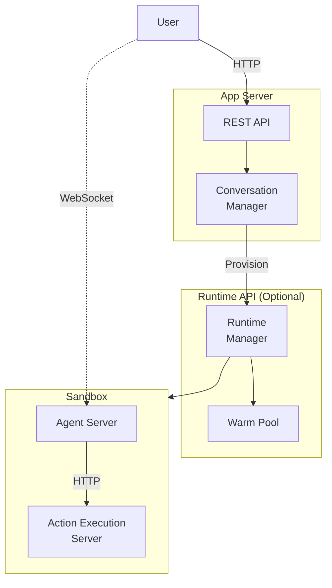

# System Architecture Overview

OpenHands supports multiple deployment configurations. This document describes the core components and how they interact.

## Local/Docker Deployment

The simplest deployment runs everything locally or in Docker containers:

### Core Components

| Component | Purpose | Location |
|-----------|---------|----------|
| **Server** | REST API, conversation management, runtime orchestration | `openhands/server/` |
| **Runtime** | Abstract interface for sandbox execution | `openhands/runtime/` |
| **Action Execution Server** | Execute bash, file ops, browser actions | Inside sandbox |
| **EventStream** | Central event bus for all communication | `openhands/events/` |

## Scalable Deployment

For production deployments, OpenHands can be configured with a separate Runtime API service:

This configuration enables:
- **Warm pool**: Pre-provisioned runtimes for faster startup
- **Direct WebSocket**: Users connect directly to their sandbox, bypassing the App Server
- **Horizontal scaling**: App Server and Runtime API can scale independently

### Runtime Options

OpenHands supports multiple runtime implementations:

| Runtime | Use Case |
|---------|----------|
| **DockerRuntime** | Local development, single-machine deployments |
| **RemoteRuntime** | Connect to externally managed sandboxes |
| **ModalRuntime** | Serverless execution via Modal |

See the [Runtime documentation](https://docs.openhands.dev/usage/architecture/runtime) for details.
